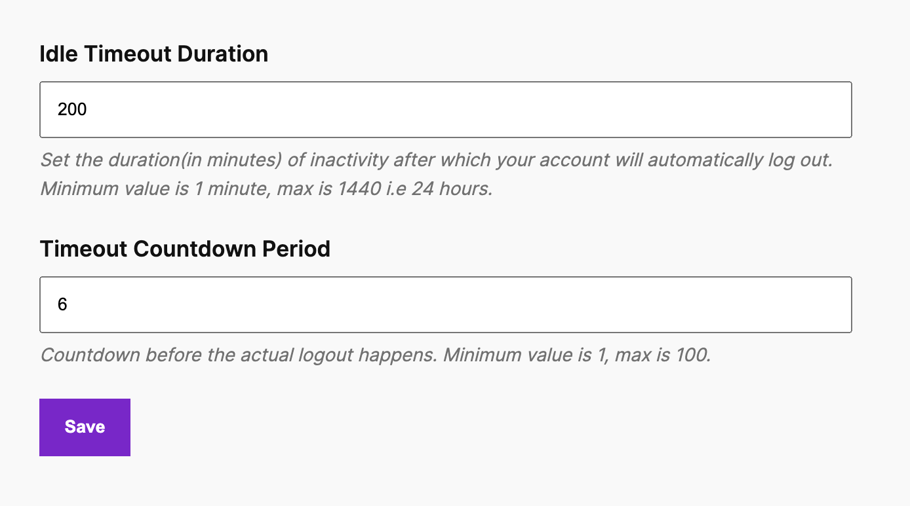

**This shortcode will only work with Inactive Logout pro enabled.**

The `[ina_user_controls]` shortcode can be used to allow users to customize the inactive logout idle timeout settings from the frontend. This shortcode enables you to conditionally display the form for users with specific roles, such as `subscriber` or `administrator`..

### Syntax

`[ina_user_controls roles="role1,role2,..." fields="idle_timeout,popup_countdown"]`

### Parameters

- **roles** (string | required)  
   A comma-separated list of user roles that can access the settings page. Only users with the specified roles will see the content within the shortcode.
- **fields** (string | optional)  
  A comma-separated list of field names. Only mentioned field names will work. If this parameter is not set then all fields will be shown.

### Example Screenshot

### Usage Examples

#### Example 1: Display content for Subscribers only

To show a message only to users with the `subscriber` role:

`[ina_user_controls roles="subscriber"]`

#### Example 2: Display content for Subscribers and Administrators

To show a message to both `subscriber` and `administrator` roles:

`[ina_user_controls roles="subscriber,administrator"]`

#### Example 3: Display content for all user roles.

`[ina_user_controls]`

#### Example 4: Display Content for all user roles but only show idle timeout change option.

`[ina_user_controls fields="idle_timeout"]`

### Important Notes

- **Role names** should be lowercase and match the role slugs used in WordPress.
- **Field names** should be lowercase, and should satisfy the above mentioned strings.

